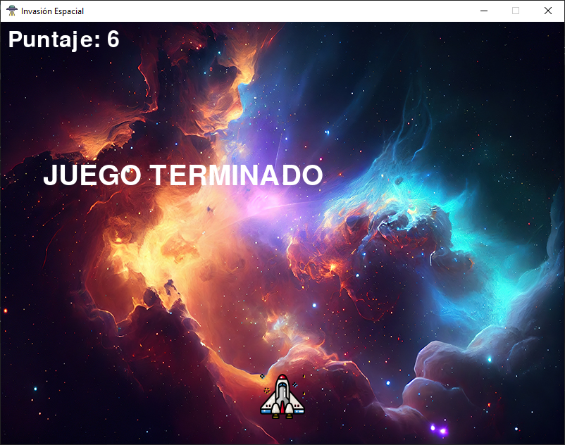

# Invasión Espacial



**Invasión Espacial** es un videojuego como *Space Invaders* desarrollado en **Python** utilizando la librería **Pygame**.  
El objetivo del jugador es eliminar a todos los enemigos antes de que lleguen a la parte inferior de la pantalla, evitando ser alcanzado y acumulando la mayor cantidad de puntos posible.

---

## Características

- Interfaz gráfica construida con `pygame.display`.
- Movimiento fluido del jugador con las teclas **←** y **→**.
- Disparo de proyectiles con la tecla **Espacio**.
- Enemigos generados aleatoriamente que se mueven en direcciones alternas.
- Detección de colisiones entre bala y enemigo.
- Sonidos de disparo, explosión y música de fondo con `pygame.mixer`.
- Texto dinámico en pantalla con el puntaje y mensaje de **"JUEGO TERMINADO"**.
- Imágenes y sonidos personalizados (nave, enemigos, fondo, música).

---

## Tecnologías utilizadas

| Tecnología | Descripción |
|-------------|-------------|
| **Python 3.x** | Lenguaje principal del proyecto. |
| **Pygame** | Librería usada para la creación de videojuegos en 2D. |
| **Pygame Mixer** | Módulo de audio utilizado para efectos de sonido y música de fondo. |

---

## Estructura de archivos recomendada

```
InvasionEspacial/
│
├── main.py
├── requirements.txt
├── README.md
│
├── assets/
│   ├── img/
│   │   ├── fondo.jpg
│   │   ├── ovni.png
│   │   ├── extraterrestre.png
│   │   ├── bala.png
│   │   └── astronave.png
│   │
│   └── sounds/
│       ├── MusicaFondo.mp3
│       ├── disparo.mp3
│       └── Golpe.mp3
│
└── venv/ (entorno virtual)
```

---

## Instalación y ejecución

### Clonar el repositorio
```bash
git clone https://github.com/OscarBR7/Juego-Nave-Espacial.git
cd Juego-Nave-Espacial
```

### Crear y activar un entorno virtual
```bash
python -m venv venv
.env\Scriptsctivate   # En Windows
source venv/bin/activate  # En Linux/Mac
```

### Instalar dependencias
```bash
pip install -r requirements.txt
```

### Ejecutar el juego
```bash
python main.py
```

---

## Controles

| Tecla | Acción |
|-------|--------|
| ⬅️ | Mover nave a la izquierda |
| ➡️ | Mover nave a la derecha |
| ␣ | Disparar bala |
| ❌ | Cerrar el juego |

---


## Autor

Oscar Briones
